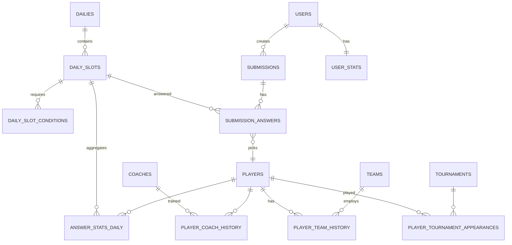

# League of Legends Esports Roster Challenge
## Kompletna Dokumentacja Techniczna v1.0

**Projekt:** Worlds XI / LoL Roster Challenge  
**Data:** 2026-07-06  
**Autor:** Senior Full Stack Engineer & Software Architect  
**Status:** DO AKCEPTACJI – przed implementacją

---

## 0. Spis treści

1. Architektura aplikacji
2. Struktura folderów (monorepo)
3. Schemat bazy danych – ERD
4. Modele danych – Django ORM + Prisma mirror
5. Endpointy API (REST)
6. Mechanizm naliczania punktów
7. Algorytm Diamond Pick
8. Algorytm wyliczania rzadkości odpowiedzi
9. Generator Daily Challenge
10. Panel administratora
11. Frontend – UX/UI spec
12. Plan scrapera
13. Internacjonalizacja PL/EN
14. Bezpieczeństwo, skalowalność, observability
15. Plan wdrożenia Docker

---

## 1. Architektura aplikacji

### 1.1 High-level

```
[ Client Browser / Mobile ]
        |
   Next.js 14 (App Router)
   React / TypeScript / Tailwind
   TanStack Query + Zustand
        |
   REST API JSON (HTTPS)
        |
[ Django 5 + DRF API ]
   |
   +-- PostgreSQL 16 (główna baza)
   +-- Redis 7 (cache, queues, Diamond locks, rate limit)
   +-- Celery + Celery Beat (jobs: nightly scoring, daily generation)
   +-- Django Admin + custom Admin SPA
        |
[ Scraper Service (Python) ]
   -> Leaguepedia / gol.gg
```

**Filozofia:** stateless API, daily seed deterministyczny, obliczenia rzadkości post-factum batchowo, Diamond Pick first-write-wins z Redis lockiem.

### 1.2 Komponenty

- **web/** – Next.js frontend, SSR/SSG dla Daily metadata, CSR dla gry.
- **api/** – Django + DRF. Moduły: players, dailies, submissions, scoring, auth, admin_tools.
- **worker/** – Celery workers.
- **scraper/** – niezależny Python module, ETL Leaguepedia + gol.gg.
- **db/** – Postgres + migracje Django.
- **infra/** – docker-compose, nginx, reverse proxy.

### 1.3 Technologie – uzasadnienie

Frontend: **Next.js 14**, React 18, **TypeScript 5**, **TailwindCSS 3.4**, shadcn/ui, **Zustand** (global UI state), **TanStack Query v5** (server cache), next-intl (i18n PL/EN), Framer Motion.

Backend: **Python 3.12**, **Django 5.0**, **Django REST Framework**, **PostgreSQL 16** (JSONB dla elastycznych atrybutów), **Redis 7**, **Celery**, **django-filter**, **drf-spectacular** (OpenAPI), **django-allauth / dj-rest-auth** (Google, Discord OAuth).

### 1.4 Przepływ Daily

1. 00:05 UTC – Celery Beat generuje Daily #N+1 na jutro (draft).
2. 00:00 Europe/Warsaw – publikacja Daily.
3. Gracz GET /dailies/today → dostaje 5 slotów + warunki (bez odpowiedzi).
4. POST /submissions – 1 raz / dzień / user_id lub guest_token. Walidacja poprawności – zapis.
5. 23:59:59 – zamknięcie.
6. 00:01 – scoring job: agregacja odpowiedzi, wyliczenie rzadkości, Diamond weryfikacja, punkty.
7. Wyniki widoczne wg configu: instant lub after_close.

---

## 2. Struktura folderów

```
lol-roster-challenge/
├── docker-compose.yml
├── docker-compose.prod.yml
├── .env.example
├── Makefile
│
├── frontend/                  # web/
│   ├── app/
│   │   ├── [locale]/
│   │   │   ├── layout.tsx
│   │   │   ├── page.tsx              # Home / Today
│   │   │   ├── daily/[id]/page.tsx
│   │   │   ├── results/[id]/page.tsx
│   │   │   ├── profile/page.tsx
│   │   │   ├── leaderboard/page.tsx
│   │   │   └── admin/                # Admin SPA
│   ├── components/
│   │   ├── roster/
│   │   │   ├── RosterBoard.tsx       # 5 pól Top/Jungle/Mid/ADC/Support
│   │   │   ├── SlotCard.tsx
│   │   │   ├── PlayerSearch.tsx
│   │   ├── ui/                       # shadcn
│   ├── lib/
│   │   ├── api.ts                    # TanStack Query client
│   │   ├── store.ts                  # Zustand
│   ├── i18n/
│   │   ├── pl.json
│   │   ├── en.json
│   ├── tailwind.config.ts
│   ├── next.config.js
│   ├── package.json
│   └── Dockerfile
│
├── backend/
│   ├── config/
│   │   ├── settings.py
│   │   ├── urls.py
│   │   ├── celery.py
│   ├── apps/
│   │   ├── players/
│   │   │   ├── models.py
│   │   │   ├── serializers.py
│   │   │   ├── views.py
│   │   │   ├── filters.py
│   │   ├── dailies/
│   │   │   ├── models.py
│   │   │   ├── generator.py
│   │   │   ├── validators.py
│   │   ├── submissions/
│   │   │   ├── models.py
│   │   │   ├── services.py           # Diamond Pick lock
│   │   ├── scoring/
│   │   │   ├── engine.py
│   │   │   ├── rarity.py
│   │   │   ├── tasks.py
│   │   ├── users/
│   │   ├── admin_tools/
│   ├── prisma/
│   │   └── schema.prisma             # mirror do typów TS
│   ├── manage.py
│   ├── requirements.txt
│   └── Dockerfile
│
├── scraper/
│   ├── leaguepedia/
│   │   ├── worlds_players.py
│   │   ├── cargo_api_client.py
│   ├── golgg/
│   │   ├── player_stats.py
│   ├── etl/
│   │   ├── normalize.py
│   │   ├── upsert.py
│   ├── main.py
│   ├── requirements.txt
│   └── Dockerfile
│
├── worker/
│   └── Dockerfile  # reuse backend image, CMD celery
│
└── docs/
    ├── TECHNICAL_SPEC.md
    ├── ERD.mmd
    ├── API_OPENAPI.yaml
    └── ...
```

Uruchomienie: `docker compose up --build` – 1 komenda: postgres, redis, api, worker, beat, frontend, nginx.

---

## 3. Schemat bazy danych – ERD

Główne tabele:

- players, teams, coaches, tournaments
- player_team_history, player_tournament_appearances
- dailies, daily_slots, daily_slot_conditions
- submissions, submission_answers
- answer_stats_daily (agregat)
- users, user_stats

Klucz: atrybuty elastyczne w JSONB: `players.attributes`, `players.career_stats`.



Szczegółowe pola – sekcja 4.

Indeksy krytyczne:
- `players(nickname)`, GIN na `attributes`
- `submission_answers(daily_slot_id, player_id)`
- unique `submissions(daily_id, user_id)` + `submissions(daily_id, guest_token)`
- unique `answer_stats_daily(daily_slot_id, player_id)`
- partial unique dla Diamond: `submission_answers(daily_slot_id, player_id) WHERE is_diamond_pick = true`

---

## 4. Modele danych

### 4.1 Django ORM – core

```python
# apps/players/models.py
class Player(models.Model):
    id = models.BigAutoField(primary_key=True)
    slug = models.SlugField(unique=True)  # faker
    nickname = models.CharField(max_length=64, db_index=True)
    real_name = models.CharField(max_length=128, blank=True)
    birth_year = models.IntegerField(null=True)
    country_code = models.CharField(max_length=3)  # KOR, POL
    residency = models.CharField(max_length=8)  # LCK, LEC, LPL ...
    continent = models.CharField(max_length=16)  # Asia/Europe/...
    primary_role = models.CharField(max_length=16, choices=ROLES)
    secondary_roles = ArrayField(models.CharField(max_length=16), default=list)
    is_active = models.BooleanField(default=True)
    # Elastyczne atrybuty
    attributes = models.JSONField(default=dict)  
    # {
    #   "worlds_appearances": [2013,2015,2016,2017,2022,2023],
    #   "worlds_titles": [2013,2015,2016,2023,2024],
    #   "msi_titles": [...],
    #   "teams": [{"team_slug":"t1","years":[2013..2025]}],
    #   "coaches": ["kkOma","..."],
    #   "leagues": ["LCK"],
    #   "top_champions_career": ["Azir","Ryze","LeBlanc"],
    # }
    career_stats = models.JSONField(default=dict)
    worlds_count = models.IntegerField(default=0, db_index=True)
    worlds_titles_count = models.IntegerField(default=0, db_index=True)
    search_vector = SearchVectorField(null=True)  # pg_trgm fulltext
    updated_at = models.DateTimeField(auto_now=True)

    class Meta:
        indexes = [
            GinIndex(fields=["attributes"]),
            GinIndex(fields=["search_vector"]),
            models.Index(fields=["primary_role", "is_active"]),
        ]

class Team(models.Model):
    slug = models.SlugField(primary_key=True)
    name = models.CharField(max_length=128)
    region = models.CharField(max_length=8)
    country_code = models.CharField(max_length=3, null=True)

class Coach(models.Model):
    slug = models.SlugField(primary_key=True)
    name = models.CharField(max_length=128)

class PlayerTeamHistory(models.Model):
    player = models.ForeignKey(Player, on_delete=models.CASCADE)
    team = models.ForeignKey(Team, on_delete=models.CASCADE)
    start_date = models.DateField(null=True)
    end_date = models.DateField(null=True)
    role = models.CharField(max_length=16)

class TournamentAppearance(models.Model):
    player = models.ForeignKey(Player, on_delete=models.CASCADE)
    tournament_slug = models.CharField(max_length=64)  # worlds_2023
    year = models.IntegerField(db_index=True)
    team = models.ForeignKey(Team, null=True, on_delete=models.SET_NULL)
    role = models.CharField(max_length=16)
    placement = models.IntegerField(null=True)

# apps/dailies/models.py
class Daily(models.Model):
    id = models.AutoField(primary_key=True)  # Daily #145
    date = models.DateField(unique=True, db_index=True)
    status = models.CharField(max_length=16, choices=[
        ("draft","draft"),("published","published"),
        ("closed","closed"),("scored","scored")
    ], default="draft")
    locale_seed = models.CharField(max_length=64)
    reveal_mode = models.CharField(max_length=16, default="after_close")  # instant | after_close
    created_by = models.ForeignKey(settings.AUTH_USER_MODEL, null=True, on_delete=models.SET_NULL)
    published_at = models.DateTimeField(null=True)
    closed_at = models.DateTimeField(null=True)

class DailySlot(models.Model):
    ROLE_CHOICES = [("top","Top"),("jungle","Jungle"),("mid","Mid"),("adc","ADC"),("support","Support")]
    daily = models.ForeignKey(Daily, related_name="slots", on_delete=models.CASCADE)
    position = models.IntegerField()  # 1..5
    role = models.CharField(max_length=16, choices=ROLE_CHOICES)
    label_pl = models.CharField(max_length=128, blank=True)
    label_en = models.CharField(max_length=128, blank=True)

    class Meta:
        unique_together = [("daily","position"), ("daily","role")]
        ordering = ["position"]

class DailySlotCondition(models.Model):
    CONDITION_TYPE = [
        ("role","role"),("region","region"),("residency","residency"),
        ("country","country"),("continent","continent"),
        ("team","team"),("league","league"),
        ("worlds_appearance","worlds_appearance"),  # value: year or "any" or min_count
        ("worlds_champion","worlds_champion"),
        ("msi_appearance","msi_appearance"),
        ("coach","coach"),
        ("champion_played","champion_played"),
        ("birth_year_range","birth_year_range"),
        ("active","active"),
        ("worlds_titles_min","worlds_titles_min"),
    ]
    slot = models.ForeignKey(DailySlot, related_name="conditions", on_delete=models.CASCADE)
    condition_type = models.CharField(max_length=32, choices=CONDITION_TYPE)
    operator = models.CharField(max_length=8, default="eq")  # eq, in, gte, lte, any
    value = models.JSONField()  # "LCK" | ["T1","Fnatic"] | {"year":2020} | {"min":2015,"max":2020}
    label_pl = models.CharField(max_length=256)
    label_en = models.CharField(max_length=256)
    order = models.IntegerField(default=0)

# apps/submissions/models.py
class Submission(models.Model):
    daily = models.ForeignKey(Daily, on_delete=models.CASCADE)
    user = models.ForeignKey(settings.AUTH_USER_MODEL, null=True, blank=True, on_delete=models.SET_NULL)
    guest_token = models.CharField(max_length=64, null=True, blank=True, db_index=True)
    submitted_at = models.DateTimeField(auto_now_add=True)
    ip_hash = models.CharField(max_length=64, blank=True)
    is_scored = models.BooleanField(default=False)
    total_points = models.IntegerField(default=0)

    class Meta:
        constraints = [
            models.UniqueConstraint(fields=["daily","user"], condition=Q(user__isnull=False), name="uniq_daily_user"),
            models.UniqueConstraint(fields=["daily","guest_token"], condition=Q(guest_token__isnull=False), name="uniq_daily_guest"),
        ]

class SubmissionAnswer(models.Model):
    submission = models.ForeignKey(Submission, related_name="answers", on_delete=models.CASCADE)
    daily_slot = models.ForeignKey(DailySlot, on_delete=models.PROTECT)
    player = models.ForeignKey(Player, on_delete=models.PROTECT)
    is_correct = models.BooleanField(default=False)
    rarity_tier = models.CharField(max_length=16, null=True)  # common/rare/epic/legendary
    rarity_percent = models.FloatField(null=True)
    points_awarded = models.IntegerField(default=0)
    is_diamond_pick = models.BooleanField(default=False)
    diamond_awarded_at = models.DateTimeField(null=True)

    class Meta:
        unique_together = [("submission","daily_slot")]
        constraints = [
            models.UniqueConstraint(fields=["daily_slot","player"], condition=Q(is_diamond_pick=True), name="uniq_diamond_per_slot_player")
        ]

# apps/scoring/models.py
class AnswerStatsDaily(models.Model):
    """Agregat po zamknięciu Daily"""
    daily_slot = models.ForeignKey(DailySlot, on_delete=models.CASCADE)
    player = models.ForeignKey(Player, on_delete=models.CASCADE)
    pick_count = models.IntegerField(default=0)
    pick_percent = models.FloatField(default=0)
    rarity_tier = models.CharField(max_length=16)
    is_correct = models.BooleanField(default=True)

    class Meta:
        unique_together = [("daily_slot","player")]

class ScoringConfig(models.Model):
    """Singleton, edytowalny w adminie"""
    is_active = models.BooleanField(default=True)
    points_common = models.IntegerField(default=10)
    points_rare = models.IntegerField(default=25)
    points_epic = models.IntegerField(default=60)
    points_legendary = models.IntegerField(default=120)
    diamond_bonus = models.IntegerField(default=50)
    # progi procentowe
    threshold_rare = models.FloatField(default=20.0)    # <20%
    threshold_epic = models.FloatField(default=10.0)    # <10%
    threshold_legendary = models.FloatField(default=1.0) # <1%
    updated_at = models.DateTimeField(auto_now=True)

class UserStats(models.Model):
    user = models.OneToOneField(settings.AUTH_USER_MODEL, on_delete=models.CASCADE)
    games_played = models.IntegerField(default=0)
    total_points = models.IntegerField(default=0)
    avg_points = models.FloatField(default=0)
    best_score = models.IntegerField(default=0)
    legendary_answers = models.IntegerField(default=0)
    diamond_picks = models.IntegerField(default=0)
    current_streak = models.IntegerField(default=0)
    max_streak = models.IntegerField(default=0)
    updated_at = models.DateTimeField(auto_now=True)
```

### 4.2 Prisma schema (mirror – dla typów TS)

```prisma
// backend/prisma/schema.prisma
datasource db { provider = "postgresql"; url = env("DATABASE_URL") }
generator client { provider = "prisma-client-js" }

model Player {
  id                  BigInt   @id @default(autoincrement())
  slug                String   @unique
  nickname            String
  real_name           String?
  country_code        String
  residency           String
  continent           String
  primary_role        String
  secondary_roles     String[]
  is_active           Boolean  @default(true)
  attributes          Json
  career_stats        Json
  worlds_count        Int      @default(0)
  worlds_titles_count Int      @default(0)
  updated_at          DateTime @updatedAt

  answers SubmissionAnswer[]
}

model Daily {
  id          Int      @id @default(autoincrement())
  date        DateTime @unique
  status      String
  reveal_mode String
  slots       DailySlot[]
  submissions Submission[]
}

model DailySlot {
  id        BigInt @id @default(autoincrement())
  dailyId   Int
  daily     Daily  @relation(fields: [dailyId], references: [id])
  position  Int
  role      String
  label_pl  String?
  label_en  String?
  conditions DailySlotCondition[]
  answers   SubmissionAnswer[]

  @@unique([dailyId, position])
  @@unique([dailyId, role])
}

model DailySlotCondition {
  id             BigInt @id @default(autoincrement())
  slotId         BigInt
  slot           DailySlot @relation(fields: [slotId], references: [id], onDelete: Cascade)
  condition_type String
  operator       String
  value          Json
  label_pl       String
  label_en       String
  order          Int
}

model Submission {
  id            BigInt   @id @default(autoincrement())
  dailyId       Int
  daily         Daily    @relation(fields: [dailyId], references: [id])
  userId        BigInt?
  guest_token   String?
  submitted_at  DateTime @default(now())
  total_points  Int      @default(0)
  answers       SubmissionAnswer[]

  @@unique([dailyId, userId])
  @@unique([dailyId, guest_token])
}

model SubmissionAnswer {
  id                 BigInt   @id @default(autoincrement())
  submissionId       BigInt
  submission         Submission @relation(fields: [submissionId], references: [id], onDelete: Cascade)
  daily_slotId       BigInt
  daily_slot         DailySlot @relation(fields: [daily_slotId], references: [id])
  playerId           BigInt
  player             Player @relation(fields: [playerId], references: [id])
  is_correct         Boolean  @default(false)
  rarity_tier        String?
  rarity_percent     Float?
  points_awarded     Int      @default(0)
  is_diamond_pick    Boolean  @default(false)
  diamond_awarded_at DateTime?

  @@unique([submissionId, daily_slotId])
}
```
> Prisma nie jest runtime ORM – służy do generowania typów TS (`prisma generate`) i do walidacji zgodności schematu.

---

## 5. Endpointy API (REST – DRF)

Base: `/api/v1/`

**Auth**
- `POST /auth/register/` – email/password (przyszłość)
- `POST /auth/login/`
- `POST /auth/google/` `POST /auth/discord/` – OAuth code exchange
- `GET /auth/me/`

**Players**
- `GET /players/?search=faker&role=mid&region=LCK&page=1`
  - full-text search, filtry
  - response: `{results:[{id,slug,nickname,real_name,country_code,residency,primary_role,teams:[...],worlds_count,...}],...}`
- `GET /players/{slug}/` – szczegóły
- `GET /players/autocomplete/?q=fa` – szybkie podpowiedzi <150ms (Redis cache)

**Dailies**
- `GET /dailies/today/` – dzisiejsza plansza
- `GET /dailies/{id}/` – meta
- `GET /dailies/{id}/slots/` – 5 slotów + warunki PL/EN
- `GET /dailies/archive/?page=...`

**Submissions**
- `POST /submissions/` 
  ```json
  {
    "daily_id":145,
    "guest_token":"abc...",
    "answers":[
      {"slot_id": 721, "player_slug":"faker"},
      ...
    ]
  }
  ```
  Response 201 lub 409 already_submitted
- `GET /submissions/me/?daily_id=145` – własna odpowiedź
- `GET /submissions/{id}/result/` – wynik po scoringu

**Scoring / Stats**
- `GET /dailies/{id}/answer-stats/` – po zamknięciu: rarity breakdown per slot
- `GET /leaderboard/?daily_id=145&type=daily|all_time`
- `GET /users/me/stats/`

**Admin (JWT + IsStaff)**
- `POST /admin/dailies/` – create
- `PUT /admin/dailies/{id}/slots/{slot_id}`
- `POST /admin/dailies/{id}/publish`
- `POST /admin/dailies/{id}/rescore`
- `GET /admin/answer-candidates/?slot_conditions=...` – walidacja: ile graczy spełnia
- `GET /admin/scoring-config/` `PUT /admin/scoring-config/`
- `POST /admin/players/` `PATCH /admin/players/{id}/`

Wszystkie endpointy udokumentowane OpenAPI 3.1 via drf-spectacular → `/api/schema/` + Swagger `/api/docs/`.

Rate limit: 60/min IP, submissions 5/min, POST /submissions 1/daily enforced.

---

## 6. Mechanizm naliczania punktów

Konfigurowalne w tabeli `ScoringConfig` (singleton):

```
Common (>20%):        10 pkt
Rare (10–20%]:        25 pkt
Epic (1–10%]:         60 pkt
Legendary (<1%):     120 pkt
Diamond Pick bonus:  +50 pkt
```

Suma = Σ points_awarded per slot.

Warianty:
- Niepoprawna odpowiedź = 0 pkt
- Możesz w adminie zmieniać progi i punkty bez deployu

Pseudo:
```python
def points_for_tier(tier, cfg):
    return {
      "common": cfg.points_common,
      "rare": cfg.points_rare,
      "epic": cfg.points_epic,
      "legendary": cfg.points_legendary
    }[tier]
```

---

## 7. Algorytm Diamond Pick

**Zasada:** Pierwsza osoba na świecie, która poprawnie wybierze danego zawodnika dla danego slotu w danym Daily, otrzymuje 💎 Diamond Pick. Tylko 1 raz per (daily_slot, player).

**Implementacja – race-condition safe:**

1. Przy POST /submissions – dla każdej odpowiedzi:
   - Waliduj poprawność warunków (`slot.validate_player(player)`).
   - Jeśli poprawne:
     - **Redis SETNX** klucz: `diamond:{daily_id}:{slot_id}:{player_id}` → value = submission_id, EX 48h
     - Jeśli SETNX = 1 → jesteś pierwszy → `is_diamond_pick=True`, `diamond_awarded_at=now()`
     - Jeśli SETNX = 0 → ktoś był pierwszy → standard scoring
2. Dodatkowo DB unique constraint `uniq_diamond_per_slot_player` zapobiega podwójnemu zapisowi w przypadku failover Redis.
3. W nightly scoring job – weryfikacja spójności: sprawdź timestampy `submitted_at`, w razie kolizji – najwcześniejszy wygrywa, reszta traci flagę.
4. Admin może ręcznie: revoke / reassign Diamond w panelu.

Redis lock zapewnia <5ms first-write-wins globalnie. Fallback: PostgreSQL advisory lock.

---

## 8. Algorytm wyliczania rzadkości odpowiedzi

Uruchamiany po `daily.closed_at`.

```
Dla każdego DailySlot S w Daily D:
  total_submissions = COUNT(DISTINCT submission_id WHERE daily=D AND answers.slot=S)
  Dla każdego player P wybranego w S:
    pick_count = COUNT WHERE slot=S AND player=P AND is_correct=true
    pick_percent = pick_count / total_submissions * 100
    
    tier =
      if pick_percent > 20.0: "common"
      elif pick_percent > 10.0: "rare"
      elif pick_percent > 1.0: "epic"
      else: "legendary"
    
    zapisz do AnswerStatsDaily
    update SubmissionAnswer.rarity_tier/percent/points_awarded
```

Edge cases:
- total_submissions = 0 → skip
- niepoprawne odpowiedzi – nie liczą się do procentów, 0 pkt
- remisy procentowe – biorą wyższy tier (korzystny dla gracza)
- po przeliczeniu: update Submission.total_points, UserStats agregaty

Czas: <2s dla 50k submissions (batch SQL, 1 query per slot).

Jeśli `reveal_mode = instant` – scoring partial co 5 min (Celery), procenty aktualizowane live.

---

## 9. Generator Daily Challenge

Cel: 5 slotów (Top/Jungle/Mid/ADC/Support), każdy 2-3 warunki, 8–150 poprawnych odpowiedzi, brak 1 oczywistej odpowiedzi.

**Baza warunków (Condition Pool):**

- role = slot.role (zawsze implicit)
- region/residency: LCK, LPL, LEC, LCS, PCS...
- country: KR, CN, DK, PL...
- team_history: T1, Fnatic, G2, EDG, ... (top 40 teams by Worlds appearances)
- worlds_appearance: any, year=X, min_count≥N
- worlds_champion: true
- worlds_titles_min: 1,2,3,4
- msi_appearance / msi_champion
- coach: kkOma, ... (top 20)
- champion_played: z top_champions_career
- active: true/false
- birth_year_range
- continent

**Algorytm generowania 1 slotu:**
```
1. wybierz role R
2. losuj 2-3 warunki z puli kompatybilnej z R
   - unikanie sprzeczności (np. residency=LCK + country=DK – dozwolone, ale rzadkie)
3. Query: SELECT COUNT(*) FROM players WHERE matches_all(conditions) AND primary_role=R (lub secondary)
4. Sprawdź:
   - candidate_count BETWEEN 8 AND 150  # konfigurowalne
   - top_1_pick_share < 45%  # estymacja na podstawie historycznych picków (popularity_score)
   - entropy > 1.8  # Shannon entropy rozkładu – zapobiega 1 oczywistej odpowiedzi
5. Jeśli fail → re-roll warunków (max 40 prób)
6. Zapisz slot + warunki PL/EN
```

**Generator całego Daily:**
- Seed = `YYYY-MM-DD` → deterministyczny, re-produkowalny
- Zachowaj różnorodność regionów w 5 slotach
- Unikaj duplikowania tego samego warunku >2 razy w Daily
- Po wygenerowaniu – admin review (draft → publish)

Admin UI: „Generate”, „Re-roll slot”, „Check candidates [42 players]”, lista kandydatów z popularity.

---

## 10. Panel administratora

Dwie warstwy:
1. **Django Admin** – szybki CRUD: Player, Team, Coach, ScoringConfig
2. **Custom Admin SPA** (`/admin`) – Next.js protected:
   - Daily Builder: drag 5 slotów, condition picker z live candidate count
   - Answer candidate preview – tabela graczy spełniających warunki
   - Scoring config editor
   - Rescore button
   - Diamond Pick manager – lista, revoke
   - Statystyki: DAU, submissions/day, rozkład rarity, top picked players
   - Player editor – JSON attributes editor z walidacją schema

RBAC: `is_staff` + permission `dailies.change_daily`.

---

## 11. Frontend – UX/UI spec

Inspiracja: Kontra.games – minimalistyczny, czytelny + LoL estetyka: ciemny motyw #0A0E13, złote akcenty #C89B3C, niebieskie #0AC8B9.

**Layout:**
- Header: logo „Worlds XI”, Daily #145, język PL/EN toggle, Login
- Główna plansza: 5 kart vertical (mobile) / grid (desktop)
  Każda karta SlotCard:
  - Role icon (Top/Jg/Mid/ADC/Sup)
  - 2–3 warunki jako pill chips PL/EN
  - Input search → PlayerSearch autocomplete
  - Wybrany gracz: avatar, nick, team flag
- Przycisk „Wyślij skład” – confirm modal: „Jedna próba dziennie. Na pewno?”
- Po wysłaniu: locked state, timer do wyników
- Results view: każda odpowiedź + rarity badge (Common szary, Rare niebieski, Epic fiolet, Legendary złoty puls, Diamond 💎 animacja)
- Profil: historia, streak, Diamond Picks galeria
- Leaderboard

**Tech detale:**
- Zustand store: `useRosterStore` – {dailyId, slots:[{slotId, player?}], submitted}
- TanStack Query: `useDailyToday()`, `usePlayerSearch(q)`, `useSubmitRoster()`
- Tailwind + shadcn/ui + Framer Motion – subtelne wejścia
- Responsywne: mobile-first, 360px+
- i18n: next-intl, pl.json / en.json – wszystkie warunki mają label_pl / label_en z backendu

**Dostępność:** keyboard nav, ARIA, kontrast AA.

---

## 12. Plan scrapera

**Źródła:**
1. **Leaguepedia (lol.fandom.com) – Cargo API** – główne źródło prawdy
   - `https://lol.fandom.com/wiki/Special:CargoExport`
   - Tabele: `ScoreboardPlayers`, `PlayerResidency`, `TournamentResults`, `PlayerTeams`
   - Query: wszyscy gracze z `Tournament = Worlds` Year 2011–2025
   - Dane: nickname, real_name, country, residency, role, team_history, birthdate, coaches
2. **gol.gg** – uzupełniająco: champion stats, top 3 champions
   - `https://gol.gg/players/list/season-S15/...` – scraping HTML z rate limit 1 req/2s, cache
   - respekt robots.txt

**ETL Pipeline (`scraper/main.py`):**
```
extract_leaguepedia_worlds_players(years=2011..2025)
  -> raw_players.json
extract_golgg_champion_stats()
  -> raw_champion_stats.json
transform_normalize()
  -> players_normalized.json  # mapowanie ról, krajów, team slugów
load_upsert_postgres()
  -> UPSERT players ON slug
  -> update attributes JSONB
  -> update search_vector
```

- Idempotency: slug = `unidecode(nickname.lower())`
- Incremental: `?last_updated_after`
- Run: `python -m scraper.main --years 2011-2025 --full`
- Cron: weekly incremental w Celery Beat
- Walidacja: Pydantic models, schema check
- Logging: structured JSON
- Dry-run mode w adminie

Docelowa baza: ~1500 unikalnych graczy Worlds S1–S13 + S14/S15 2024/2025.

**Mapowanie warunków → atrybuty JSON:**
```json
{
  "worlds_appearances": [2013,2015,2016],
  "worlds_titles": [2013,2015,2016],
  "msi_appearances": [2015,2016,2017],
  "teams": [{"slug":"t1","name":"T1","years":[2013,2014,...]}],
  "leagues": ["LCK"],
  "coaches": ["kkoma","..."],
  "top_champions_career": [
    {"champion":"Azir","games":78},
    {"champion":"Ryze","games":65}
  ],
  "birth_year":1996,
  "country":"KR",
  "residency":"LCK",
  "continent":"Asia"
}
```

Warunki w DailySlotCondition evaluowane przez:
```python
def player_matches(player: Player, conditions: list) -> bool:
    for c in conditions:
        if not CONDITION_EVALUATORS[c.condition_type](player, c.operator, c.value):
            return False
    return True
```
Evaluatory korzystają z JSONB + indeksów GIN.

---

## 13. Internacjonalizacja PL / EN

- Backend: wszystkie encje z `label_pl`, `label_en`. API zwraca oba, frontend wybiera po locale.
- Frontend: next-intl
  - `/pl/daily/...` `/en/daily/...`
  - słowniki: `i18n/pl.json`, `i18n/en.json` – UI strings
  - warunki – z API
  - Role: Top / Dżungla / Środek / Strzelec / Wspierający
- Domyślny locale: PL, fallback EN
- Dane graczy (nickname, team) – uniwersalne, bez tłumaczenia

---

## 14. Bezpieczeństwo, skalowalność, observability

- **Auth:** dj-rest-auth + allauth, JWT access 15 min / refresh 30 dni, HttpOnly cookies, CSRF.
- **Guest:** signed guest_token (UUID v4), localStorage, możliwość „claim” po rejestracji → merge submissions.
- **Rate limiting:** django-ratelimit + Redis.
- **Walidacja:** submissions tylko przed close, 1 per user/day, server-side condition check.
- **Skalowanie:** API stateless, horizontal (3+ replicas), Postgres read replica ready, Redis cluster ready.
- **Cache:** player autocomplete 5 min, daily slots 1h, CDN dla frontendu.
- **Observability:** structlog JSON, Sentry (backend+frontend), Prometheus metrics `/metrics`, Grafana dashboard.
- **Backup:** pg_dump nightly, S3.
- **RODO:** usuwanie konta → anonimizacja submissions.
- **Testy:** pytest (backend >80%), Vitest (frontend), Playwright E2E.

---

## 15. Plan wdrożenia Docker

**docker-compose.yml – 1 komenda**

Services:
- `db` – postgres:16-alpine, volume pgdata, init script
- `redis` – redis:7-alpine
- `api` – build ./backend, gunicorn, port 8000, depends_on db, redis, env_file
- `worker` – same image backend, command `celery -A config worker`
- `beat` – same image, `celery -A config beat`
- `frontend` – build ./frontend, Next.js standalone, port 3000
- `nginx` – reverse proxy, /api → api:8000, / → frontend:3000

```yaml
# skrót
version: "3.9"
services:
  db: ...
  redis: ...
  api: build: ./backend ...
  worker: ...
  beat: ...
  frontend: ...
  nginx: ports: "80:80"
```

`.env.example` zawiera:
```
POSTGRES_DB=lolroster
POSTGRES_USER=...
DATABASE_URL=postgres://...
REDIS_URL=redis://redis:6379/0
DJANGO_SECRET_KEY=...
NEXT_PUBLIC_API_URL=http://localhost/api/v1
GOOGLE_OAUTH_CLIENT_ID=...
DISCORD_OAUTH_CLIENT_ID=...
```

**Make targets:**
```
make up        # docker compose up --build
make migrate   # backend migrate + createsuperuser
make seed      # python manage.py seed_players --sample
make scrape    # run scraper full
make test
```

Deploy prod: docker-compose.prod.yml + Traefik + Let's Encrypt, GitHub Actions CI.

---

## 16. Roadmap implementacji (po akceptacji)

**Etap 0 – Setup (1–2 dni)**
- Monorepo, Docker Compose, CI lint

**Etap 1 – Baza danych + modele (2 dni)**
- Django modele, migracje, Django Admin, seed 50 top graczy

**Etap 2 – Scraper MVP (2–3 dni)**
- Leaguepedia Cargo ETL, 1500 graczy Worlds

**Etap 3 – API Daily + Submissions (2 dni)**
- endpoints /dailies, /players, /submissions, walidacja warunków

**Etap 4 – Scoring + Diamond + Rarity (2 dni)**
- engine, Celery jobs, testy

**Etap 5 – Frontend core (3–4 dni)**
- Next.js setup, RosterBoard, PlayerSearch, submit flow, results

**Etap 6 – Auth + UserStats + Leaderboard (2 dni)**
- Google/Discord, profile

**Etap 7 – Admin panel + Generator (2 dni)**
- Daily Builder, candidate preview

**Etap 8 – Polish + i18n + deploy (2 dni)**

Łącznie: ~16–19 dni roboczych 1 senior full-stack.

---

## 17. Ryzyka i decyzje do potwierdzenia

1. **Prisma vs Django ORM** – runtime: **Django ORM**. Prisma schema trzymamy jako mirror do typów TS (prisma generate → types). OK?
2. **Reveal mode domyślny:** `after_close` czy `instant`? Proponuję `after_close` dla lepszej gry w rzadkość.
3. **Punktacja finalna:** Common 10 / Rare 25 / Epic 60 / Legendary 120 / Diamond +50 – zatwierdzić?
4. **Progi rarity:** 20% / 10% / 1% – zatwierdzić?
5. **Strefa czasowa Daily:** Europe/Warsaw 00:00 – OK?
6. **Minimalna liczba kandydatów w slocie:** 8–150 – OK?
7. **Źródła scrapera:** Leaguepedia primary + gol.gg secondary – zaakceptować?
8. **Auth MVP:** Google + Discord od startu, email później – OK?
9. **Guest merge:** czy po rejestracji przepinamy guest_token submissions do user_id? Proponuję TAK.
10. **Nazwa produktu:** „Worlds XI”, „LoL Roster Challenge”, inna?

---

**Koniec dokumentu v1.0**

Czekam na akceptację / uwagi. Po akceptacji startuję Etap 0 → kod: monorepo + Docker + modele.
